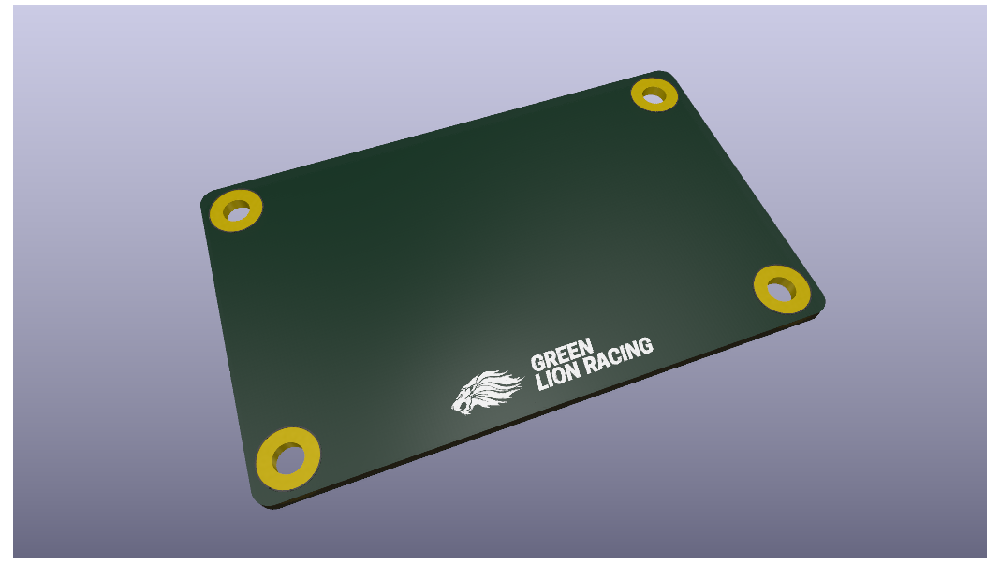
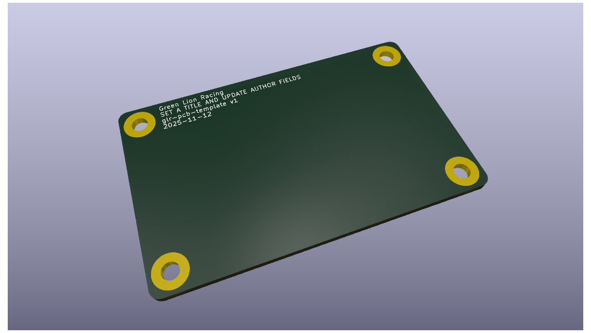

# glr-pcb-template

This is a KiCad template repository for PCBs designed by the Green Lion Racing team.

  
  

## Overview

In this to be longer overview, you could write what this board does what are it main components and such.

## How to use this template

You can use this template by clicking on this [link](https://github.com/new?owner=green-lion-racing&template_name=glr-pcb-template&template_owner=green-lion-racing) or clicking the button `Use this template`. And set your repository name to `glr-pcb-your-project-name`.

This is a list of task you should first do when using this template:

- [ ] Rename every occurence of `glr-pcb-template` to `glr-pcb-your-project-name`. Occurence of this string are found here:
  
  - Project files e. g. `glr-pcb-template.kicad_pcb`, `glr-pcb-template.kicad_pro`, and `glr-pcb-template.kicad_sch`.
  
  - Title of this `README.md` file.
  
  - Images in `img/` and its references in `README.md`.
  
  - Inside of files `glr-pcb-template.kicad_pro` find the line with `glr-pcb-template` and change to `glr-pcb-your-project-name`.

- [ ] Change short description and longer overview of this board in `README.md`.

- [ ] Replace display images in `img/` used in `README.md` of a rendering of your pcb.

- [ ] Fill out used parts table in `README.md`.

Remove this template guide when everything is changed. 

## Used parts

| Article | Description | Perma-Link | Quantity |
| ------- | ----------- | ---------- | -------- |
|         |             |            |          |
