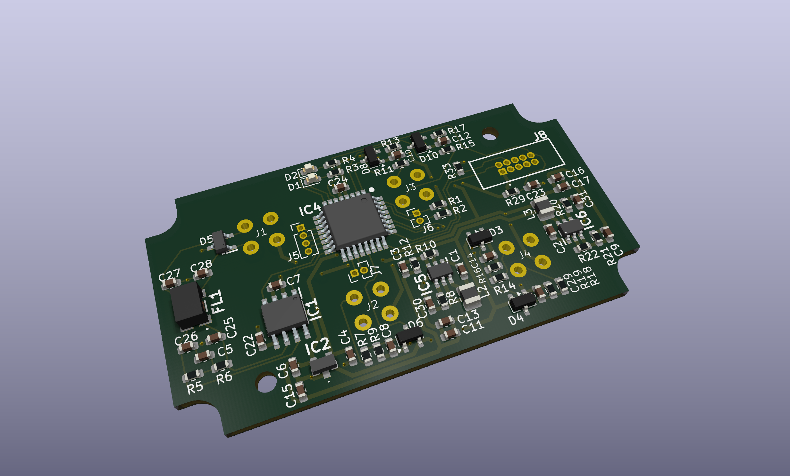
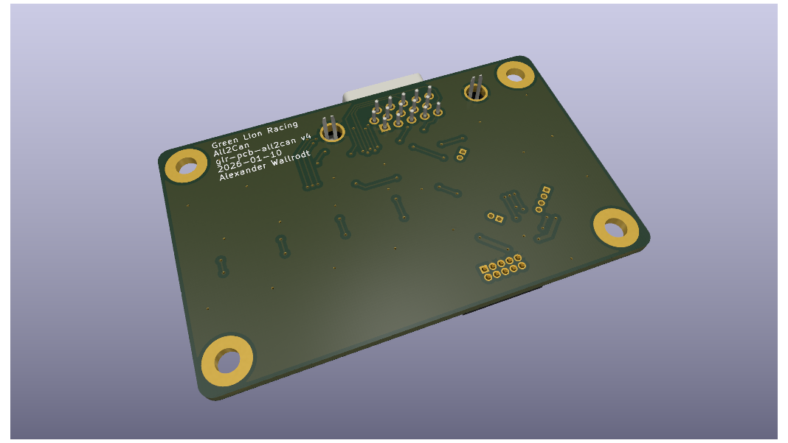
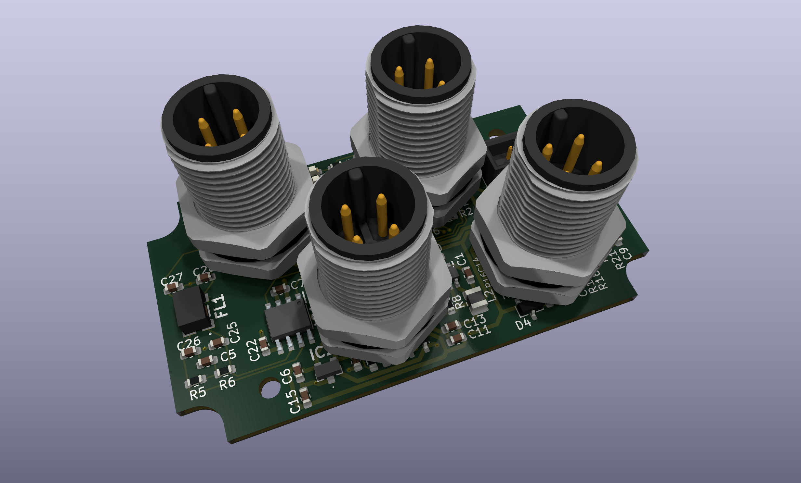

# glr-pcb-all2can

This is a KiCad PCB repository for the [All2Can](https://github.com/green-lion-racing/glr-all2can) software.

  
  

  

## Overview

This PCB is intended to collect sensor data and provide that to can.

The connector is D-Sub 15-pin male.  
It supports a 24V power supply voltage.  
One CAN (up to 5 MB/s) connection.  
Uses a `STMSTM32C092KCT6` microcontroller (250kbytes Flash 36kbytes Ram).  
It also preserves space for an 6-axis IMU `LSM6DSV16BXTR`.  

There are 7 analog/digital inputs (input voltage level is configurable by a voltage divider).  
And 4 digital outputs (5V level).

Provides headers for SPI, I2C, UART.

## History

This PCB is actually the fourthst generation of this type used for our team.

1. [Frist version](https://circuitmaker.com/Projects/Details/Pat-Her/All2Can-V01) in CircuitMaker.  
   By [PatHer777](https://github.com/PatHer777).

2. [Second version](https://circuitmaker.com/Projects/Details/Jannis-Dohm/All2Can) also in CircuitMaker with some changes.  
   By Jannis Dohm.

3. Third in Fusion 360, with new PCB design.  
   By Alexander Wallrodt.

4. Now [fourth version](https://github.com/green-lion-racing/glr-pcb-all2can) in KiCad, with some changes to schematic and smaller PCB.  
   By Alexander Wallrodt.

## Used parts

Exported from KiCad BOM. View there for more details.

| DigiKey                     | WuerthElektronik | Reference                                                | Qty | Value                                 | Footprint                            |
|-----------------------------|------------------|----------------------------------------------------------|-----|---------------------------------------|--------------------------------------|
| 311-100KHRCT-ND             |                  | R33                                                      | 1   | 100k                                  | Resistor_SMD:R_0603_1608Metric       |
| RMCF0603FT115KCT-ND         |                  | R12                                                      | 1   | 115k                                  | Resistor_SMD:R_0603_1608Metric       |
| 311-22.1KHRCT-ND            |                  | R10,R22                                                  | 2   | 22.1k                                 | Resistor_SMD:R_0603_1608Metric       |
|                             |                  | R9,R13,R16,R17,R19,R21                                   | 6   | ~                                     | Resistor_SMD:R_0603_1608Metric       |
| P30KDBCT-ND                 |                  | R7,R11,R14,R15,R18                                       | 5   | 30k                                   | Resistor_SMD:R_0603_1608Metric       |
| 541-60.4HCT-ND              |                  | R5,R6                                                    | 2   | 60                                    | Resistor_SMD:R_0603_1608Metric       |
| P120DBCT-ND                 |                  | R3,R4                                                    | 2   | 120                                   | Resistor_SMD:R_0603_1608Metric       |
| 311-10.0KHRCT-ND            |                  | R1,R2,R8,R20,R29                                         | 5   | 10k                                   | Resistor_SMD:R_0603_1608Metric       |
|                             |                  | L3                                                       | 1   | ~                                     | Inductor_SMD:L_1008_2520Metric       |
| 732-74479889310CT-ND        | 74479889310      | L2                                                       | 1   | 10u                                   | Inductor_SMD:L_1008_2520Metric       |
| 732-62701021621-ND          | 62701021621      | J8                                                       | 1   | 62701021621                           | SamacSys_Parts:62701021621           |
| 732-643250100304-ND         | 643250100304     | J1,J2,J3,J4                                              | 4   | Conn_02x02_Counter_Clockwise_Shielded | GLR_KiCad_Library:M12A-04P           |
| 31-AP64060QWU-7CT-ND        |                  | IC5,IC6                                                  | 2   | AP64060WU-7                           | SamacSys_Parts:SOT95P280X100-6N      |
| 497-STM32C092KCT6-ND        |                  | IC4                                                      | 1   | STM32C092KCT6                         | SamacSys_Parts:QFP80P900X900X160-32N |
| ZMR330FCT-ND                |                  | IC2                                                      | 1   | ZMR330FTA                             | SamacSys_Parts:ZMR330FTA             |
| ATA6561-GAQW-NCT-ND         |                  | IC1                                                      | 1   | ATA6561-GAQW-N                        | SamacSys_Parts:SOIC127P600X175-8N    |
| 732-7290-1-ND               | 744235510        | FL1                                                      | 1   | Choke                                 | SamacSys_Parts:744235510             |
| 497-15333-1-ND              |                  | D5                                                       | 1   | ESDCAN01-2BLY                         | SamacSys_Parts:SOT95P255X125-3N      |
| 4878-BAT54SCT-ND            |                  | D3,D4,D6,D8,D10                                          | 5   | BAT54S                                | Package_TO_SOT_SMD:SOT-23            |
| 160-1436-1-ND,160-1447-1-ND |                  | D1,D2                                                    | 2   | LED                                   | LED_SMD:LED_0603_1608Metric          |
| 1276-1040-1-ND              |                  | C30,C31                                                  | 2   | 2u2                                   | Capacitor_SMD:C_0603_1608Metric      |
| 490-1427-1-ND               |                  | C25,C26,C27,C28                                          | 4   | 100p                                  | Capacitor_SMD:C_0603_1608Metric      |
| 399-C0603C105K4RACTUCT-ND   |                  | C11,C16,C24                                              | 3   | 1u                                    | Capacitor_SMD:C_0603_1608Metric      |
| 1292-0603X106M100CT-ND      |                  | C4,C6                                                    | 2   | 10u                                   | Capacitor_SMD:C_0603_1608Metric      |
| 399-C0603C104K3RACTUCT-ND   |                  | C1,C2,C3,C5,C7,C8,C9,C10,C12,C13,C14,C15,C17,C22,C23,C29 | 16  | 100n                                  | Capacitor_SMD:C_0603_1608Metric      |
